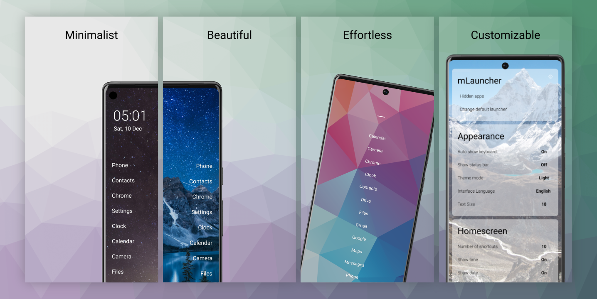

<h1 align="center">Based on <a href="https://github.com/OlauncherCF/OlauncherCF">OlauncherCF</a>. Minimal and clean of back links</h1>

<h3 align="center">mLauncher is a minimal app launcher for Android.

We try to balance customizability and minimalization well still being simple :)</h3>

# Forked with extra features

- Ability for more customizability on home screen gestures.
- Ability to toggle the automation of opening app if last in list.
- A lot of people have translated the app to the following languages. Many thanks to you all.
  - Albanian
  - Bulgarian
  - Czech
  - Danish
  - Estonian
  - Filipino
  - Finnish
  - Georgian
  - Greek
  - Hawaiian
  - Hebrew
  - Hindi
  - Hungarian
  - Icelandic
  - Irish
  - Japanese
  - Lithuanian
  - Luxembourgish
  - Malay
  - Malagasy
  - Malayalam
  - Norwegian
  - Nepali
  - Polish
  - Punjabi
  - Serbian
  - Sindhi
  - Thai

## Installation

- This app is available on [F-Droid](https://f-droid.org/packages/app.mlauncher/) & [Github](https://github.com/HeCodes2Much/mLauncher/releases/) <!-- Useful when relsease will be automatically generated by github -->
- The latest stable version is on the [`main`](https://github.com/HeCodes2Much/mLauncher/tree/main) branch. You can clone it and build the app yourself.
<!-- - A github action should build an apk for every [release](https://github.com/HeCodes2Much/mLauncher/releases). Useful when relsease will be automatically generated by github -->
- The **original app** is also available on [F-Droid](https://f-droid.org/fr/packages/app.olaunchercf/) & [Github](https://github.com/OlauncherCF/OlauncherCF).

## Contribute

- If you are unhappy with any part of the app or feel like missing something, you can open a pull request or an [**issue**](https://github.com/HeCodes2Much/mLauncher/issues/new/choose) as you like.
  - Please go through the issues marked as `Bug report`, `Crash report` or `Feature request`.
  - Please can we discuss before sending pull requests.
  - Make pull requests to `main` branch.
- Any help in translating mLauncher into other languages is greatly appreciated. If you don't know how to perform a pull request, feel free to check out our dedicated [**Wiki**](https://github.com/HeCodes2Much/mLauncher/wiki).

## License

**mLauncher is under open source GPL3 license, meaning you can use, study, change and share it at will.**
Copyleft ensures it stays that way. From the full source, anyone can build, fork and use as you wish

- mLauncher does not have network access.
- mLauncher does not collect or transmit any data in any way whatsoever.

## Permissions

mLauncher uses the following permissions:

- `android.permission.EXPAND_STATUS_BAR`
  - Allows an application to expand or collapse the status bar.
- `android.permission.QUERY_ALL_PACKAGES`
  - Allows query of any normal app on the device, regardless of manifest declarations. Used to show the apps list.
- `android.alarm.permission.SET_ALARM`
  - Allows an application to broadcast an Intent to set an alarm for the user. Used to open the default alarm app if no other clock app is set in the settings.
- `android.permission.REQUEST_DELETE_PACKAGES`
  - Required for issuing the request to remove packages. This does not allow the app to remove apps directly; this only gives the permission to issue the request.
