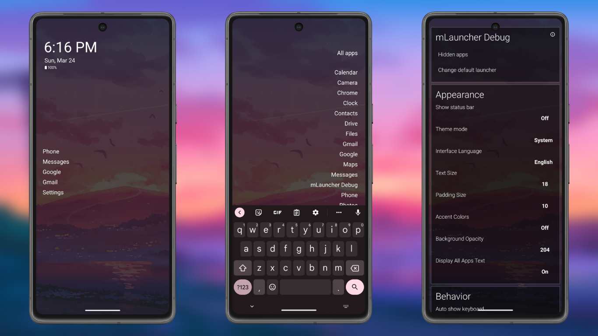
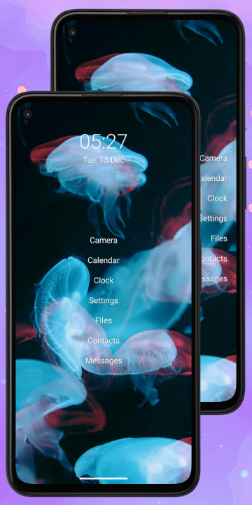
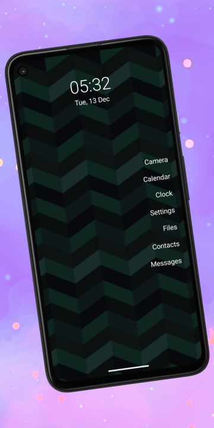
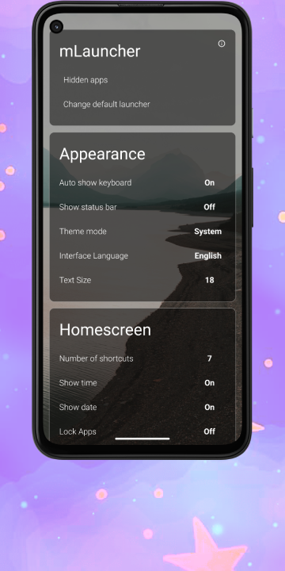
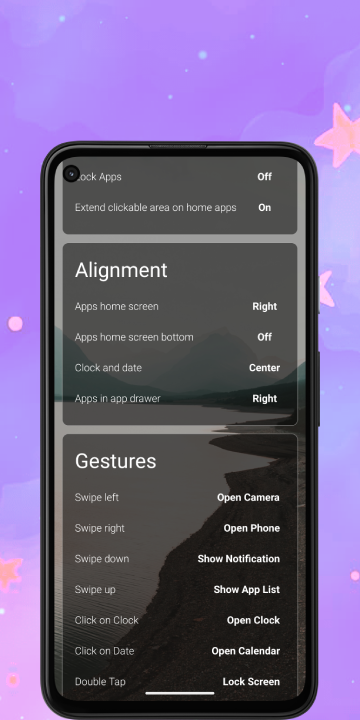
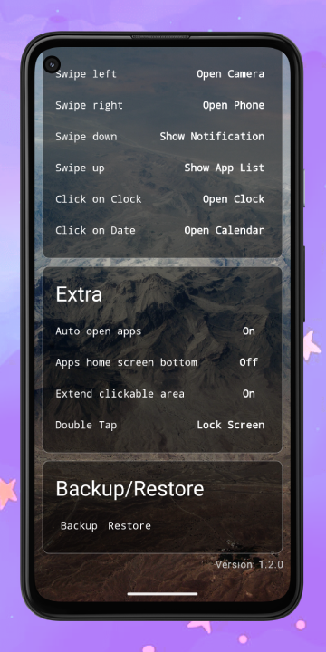

	<h2>mLauncher - Minimal and Clutter Free Android launcher</h2>
    <table align='center'>
        Click on any image to enlarge it. To know more, explore and see for yourself.
        <tr>
            <td></td>
            <td></td>
            <td></td>
            <td></td>
            <td></td>
            <td></td>
        </tr>
    </table>
    

        
    

- Chat with us at [mLauncher](https://t.me/DroidWorksStudio) on telegram.
- This application can be found on [F-Droid](https://f-droid.org/packages/app.mlauncher/) and [GitHub](https://github.com/HeCodes2Much/mLauncher/releases/).
- The latest stable version is available on the [`main`](https://github.com/HeCodes2Much/mLauncher/tree/main) branch, which can be cloned to build the application independently.
- Additionally, a GitHub action has been set up to automatically generate an APK for every [release](https://github.com/HeCodes2Much/mLauncher/releases).
- The **original** version of the application is also accessible on the [Play Store](https://play.google.com/store/apps/details?id=app.olauncher), [F-Droid](https://f-droid.org/fr/packages/app.olauncher/) & [GitHub](https://github.com/tanujnotes/Olauncher).

We try to balance customizability and minimalization well still being simple :)</h3>

# Forked with extra features

List of features (click to expand)

- Removed clutter, like ads and links.
- You can rename apps in the app-drawer (Renaming apps on the home screen is already supported. Just long-click on an app on the home screen and start typing.)
- We have added a lot more options for gestures on the home screen:
    - Gestures are now:
        - Swiping up, down, left, right
        - Clicking on the clock
        - Clicking on the Date
    - Possible actions now include:
        - Open specified app
        - Display app list
        - Locking the screen
        - Show Recent opened apps
        - Opening the notification drawer
        - Opening the quick settings
        - Power Dialog
        - Take A Screenshot
        - Disable Gesture
- You can also position the clock independently of the home apps.
- Change alignment of apps in app-drawer independent from homescreen.
- Change font size of sections of the homescreen independent of each other.
- Removed internet permission. You never know what an app developer wants to know about you.
- Lock settings behind biometrics (toggle)
- Added the ability to report crashing via email.
- Added the ability to view app usage time.

## Translations:

We would like to extend our sincere gratitude to the numerous individuals who have contributed to the translation of our application into various languages. Your efforts have made it possible for users around the world to access and benefit from our product, and we are immensely appreciative of your hard work and dedication. Thank you all for your invaluable contributions!  

List of translations (click to expand)

  - Afrikaans
  - Arabic
  - Albanian
  - Bulgarian
  - Chinese
  - Croatian
  - Czech
  - Danish
  - English
  - Estonian
  - Filipino
  - Finnish
  - French
  - Georgian
  - German
  - Greek
  - Hawaiian
  - Hebrew
  - Hindi
  - Hungarian
  - Icelandic
  - Indonesian
  - Irish
  - Italian
  - Japanese
  - Korean
  - Lithuanian
  - Luxembourgish
  - Malay
  - Malagasy
  - Malayalam
  - Norwegian
  - Nepali
  - Persian
  - Polish
  - Portuguese (European)
  - Punjabi
  - Russian
  - Serbian
  - Sindhi
  - Spanish
  - Swedish
  - Thai
  - Turkish
  - Ukrainian
  - Vietnamese

## Contribute

- If you are unhappy with any part of the app or feel like missing something, you can open a pull request or an [**issue**](https://github.com/HeCodes2Much/mLauncher/issues/new/choose) as you like.
  - Please go through the issues marked as `Bug report`, `Crash report` or `Feature request`.
  - Please can we discuss before sending pull requests.
  - Make pull requests to `main` branch.
- Any help in translating mLauncher into other languages is greatly appreciated. If you don't know how to perform a pull request, feel free to check out our dedicated [**Wiki**](https://github.com/HeCodes2Much/mLauncher/wiki).

## License

**mLauncher is proudly licensed under the open source GPL3 license, granting users the freedom to use, study, modify and distribute it at will.**

The Copyleft provision guarantees that these freedoms remain intact, ensuring that mLauncher will remain a fully open-source project. With access to the full source code, anyone can build, fork, and customize the application to their heart's content, unleashing its full potential.

- mLauncher does not have network access.
- mLauncher does not collect or transmit any data in any way whatsoever.

## Permissions

mLauncher uses the following permissions:

- `android.permission.EXPAND_STATUS_BAR`
  - Allows an application to expand or collapse the status bar.
- `android.permission.QUERY_ALL_PACKAGES`
  - Allows query of any normal app on the device, regardless of manifest declarations. Used to show the apps list.
- `android.alarm.permission.SET_ALARM`
  - Allows an application to broadcast an Intent to set an alarm for the user. Used to open the default alarm app if no other clock app is set in the settings.
- `android.permission.REQUEST_DELETE_PACKAGES`
  - Required for issuing the request to remove packages. This does not allow the app to remove apps directly; this only gives the permission to issue the request.
- `android.permission.PACKAGE_USAGE_STATS`
  - Allows mLauncher to see usage of other apps to list last used apps first in the app list. 

## Credits
- [https://github.com/tanujnotes/Olauncher](https://github.com/tanujnotes/Olauncher)
- [https://github.com/OlauncherCF/OlauncherCF](https://github.com/OlauncherCF/OlauncherCF)

## Donation
We kindly request that you consider supporting the ongoing development of mLauncher by making a donation if you find it to be a useful application. As a free and open-source product, mLauncher depends entirely on the support and generosity of its users to maintain its continued growth and accessibility to all. Please note that while purchasing is not obligatory, even a small donation would go a long way in helping us to keep mLauncher alive and thriving. We appreciate your continued support, and thank you for your contribution towards the betterment of our product. 😊

## Build Information

    

        
        
         
        
        
         
        
         
        
    

